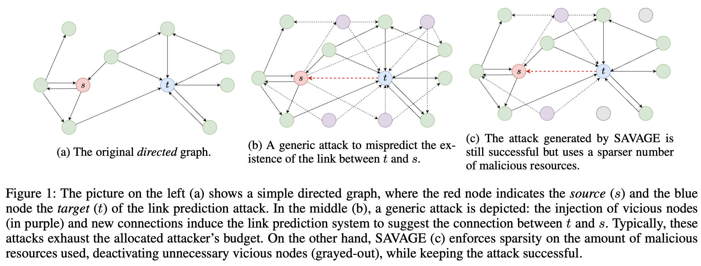

# SAVAGE

**Sparse Vicious Attacks on Graph Neural Networks** <br>Giovanni Trappolini, Valentino Maiorca, Silvio Severino, Emanuele Rodolà, Fabrizio Silvestri, Gabriele Tolomei<br>
In [Arxiv, 2022](https://arxiv.org/abs/2209.09688)



### How to use:

1. Download necessary files [here](https://drive.google.com/file/d/1SkMdz0d40JmRjEug9im5XQP5K5O0aorG/view?usp=share_link).
2. Extract the folder and put it under SAVAGE/
3. Run the file related to the desired experiment found inside test/

Example:

```
python savage_only_vicious.py
```

More instruction and functionalities coming in the next few weeks!
